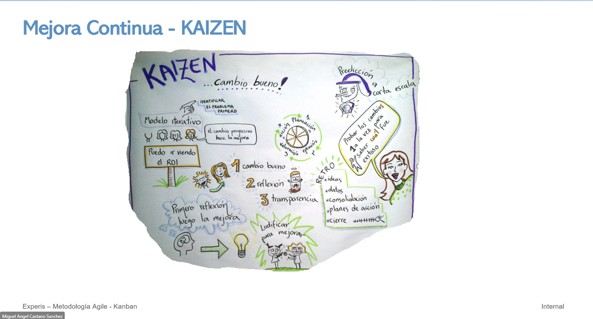

# ¿Qué es un tablero Kanban?

Un Tablero Kanban es una brillante herramienta visual que ofrece una visión general del estado actual del trabajo y simplifica la comunicación del equipo. También es un elemento fundamental del método Kanban, que ayuda a optimizar y mejorar continuamente cualquier proceso de negocios. Visualizar el trabajo en un tablero Kanban aumentará la productividad y eliminará el caos en tu lugar de trabajo.calidad y de manera más rápida.

Kanban "La Idea en mantener el flujo y eliminar perdida". (<http://kanbantool.com/kanban-library/introduction> <http://virtualkanban.net>)

# ¿Cómo funciona un tablero Kanban?

Los tableros Kanban funcionan asignando elementos de trabajo individuales a notas colocadas en columnas en un tablero grande. Las columnas del tablero representan el flujo de valor - una secuencia de pasos específicos que las tareas o productos deben atravesar desde el comienzo del proceso de trabajo hasta el final. Los elementos de trabajo se escriben en tarjetas y se colocan en sus respectivas columnas.

Se utilizan diferentes colores de tarjetas para diferentes tipos de elementos de trabajo, y se utilizan filas horizontales, conocidas como "swimlanes" (o carriles), para organizar equipos que trabajan en la misma tabla. Se pone un límite a la capacidad de algunas columnas para asegurar un flujo de trabajo fluido, y las tarjetas pull de los miembros del equipo se mueven a través de las columnas de izquierda a derecha a medida que el trabajo avanza.

> Los tableros Kanban pierden su encanto si no son fisicos pero con el trabajo remoto...

   

- Las tareas de mejora continua deben tener un responsable que se encarge ver que se está llevando todo a cabo.
