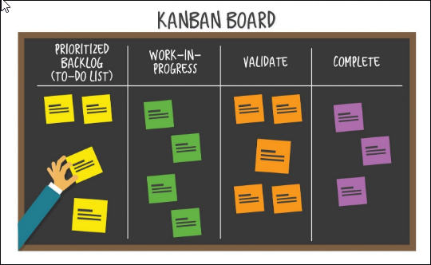
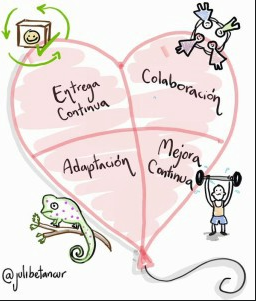
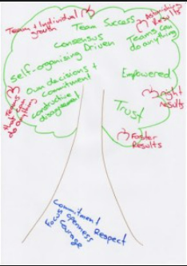
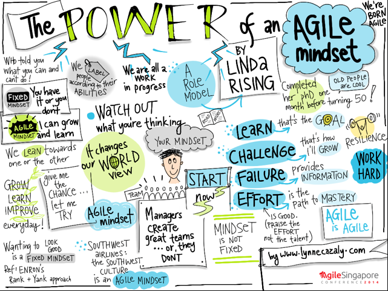
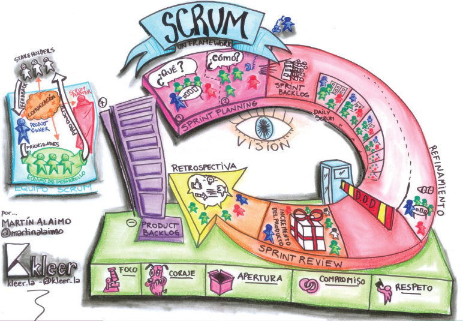
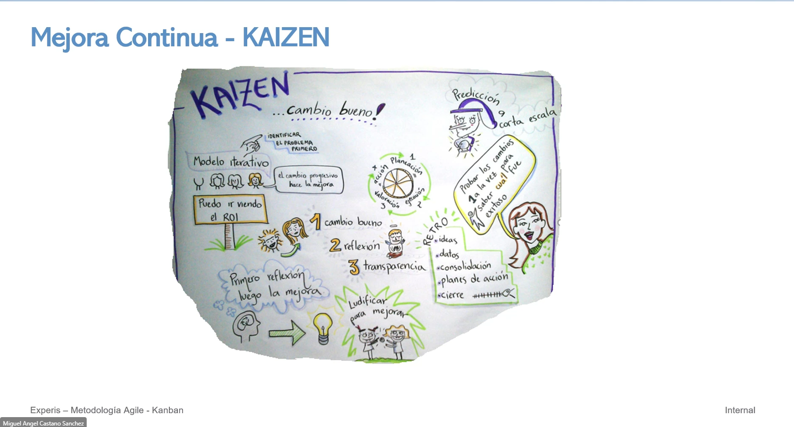

# ¿Qué es una metodología Ágil

Fomentan respuestas rápidas y flexibles al cambio mediante la planificación adaptativa, la identificación de requisitos colaborativos y la racionalización entre el equipo interfuncional autoorganizado, así como el desarrollo gradual de soluciones.

- Adaptación ante el cambio
- Equipo interfuncional autoorganizado
- Entrega continua de producto de valor

***Las personas, las relaciones y la comunicación es lo más importante de la metodología ágil.

   

### El corazón Ágil

   

> No podemos lograr una mejora contínua ni adaptarnos si no aprendemos mejores maneras de hacer las cosas. Quizá y para que quede más
> claro, seguir aprendiendo sería el aire que infla el globo-corazón.

### El árbol de los valores ágiles

   

> Las relaciones y la colaboración entre las personas son la parte más importante de la ecuación. Por supuesto, no podemos dejar 
> de buscar los resultados para el negocio. Al final es una relación simbiótica: el negocio tiene que crecer para que podamos 
> seguir prendiendo e implementando nuevas tecnologías.

### ¿Por qué Ágil?

Es necesario entender cuáles son las características del software y porqué (y cómo) el agilismo explota lo mejor de ella. El software es maleable y con características extrañas para la lógica: ¿En que otra industria la productividad se incrementa al sacar un elemento del equipo?

## Agile Mindset

Agile mindset es una combinación de principios, creencias, y forma de pensar para responder al cambio en ambientes de incertidumbre, siendo capaces de adaptarse al mismo tiempo que avanzas.

   

## Scrum

   

# ¿Qué es un tablero Kanban?

Un Tablero Kanban es una brillante herramienta visual que ofrece una visión general del estado actual del trabajo y simplifica la comunicación del equipo. También es un elemento fundamental del método Kanban, que ayuda a optimizar y mejorar continuamente cualquier proceso de negocios. Visualizar el trabajo en un tablero Kanban aumentará la productividad y eliminará el caos en tu lugar de trabajo.calidad y de manera más rápida.

   

Kanban "La Idea en mantener el flujo y eliminar perdida". (<http://kanbantool.com/kanban-library/introduction> <http://virtualkanban.net>)

## ¿Cómo funciona un tablero Kanban?

Los tableros Kanban funcionan asignando elementos de trabajo individuales a notas colocadas en columnas en un tablero grande. Las columnas del tablero representan el flujo de valor - una secuencia de pasos específicos que las tareas o productos deben atravesar desde el comienzo del proceso de trabajo hasta el final. Los elementos de trabajo se escriben en tarjetas y se colocan en sus respectivas columnas.

Se utilizan diferentes colores de tarjetas para diferentes tipos de elementos de trabajo, y se utilizan filas horizontales, conocidas como "swimlanes" (o carriles), para organizar equipos que trabajan en la misma tabla. Se pone un límite a la capacidad de algunas columnas para asegurar un flujo de trabajo fluido, y las tarjetas pull de los miembros del equipo se mueven a través de las columnas de izquierda a derecha a medida que el trabajo avanza.

> Los tableros Kanban pierden su encanto si no son fisicos pero con el trabajo remoto...

## Mejora continua - KAIZEN

> KAIZEN en japones significa *cambio para ser mejor*

   

- Las tareas de mejora continua deben tener un responsable que se encarge ver que se está llevando todo a cabo.
